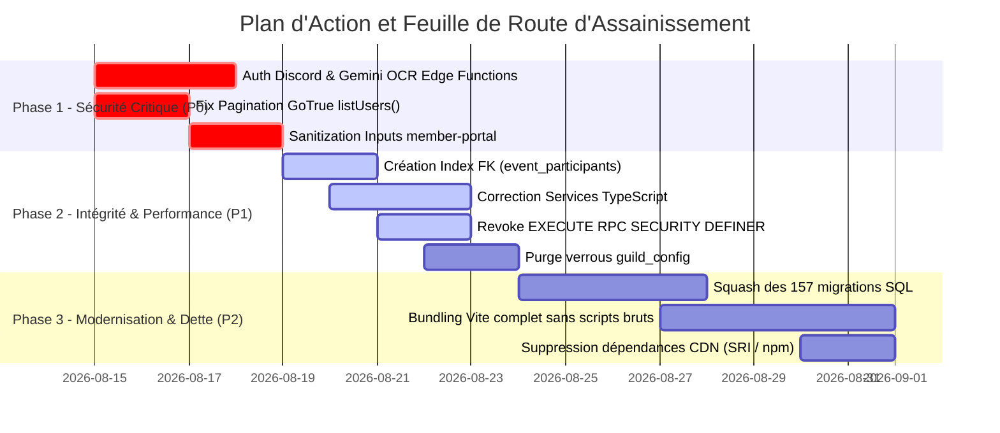

# RAPPORT GLOBAL D'AUDIT TECHNIQUE, ARCHITECTURAL, SÉCURITÉ ET FONCTIONNEL
**Projet :** FGF Guild Management Tool  
**Environnement :** Production (Vercel + Supabase Postgres 17 + GoTrue Auth + Deno Edge Functions)  
**Date d'audit :** 14 Août 2026  
**Type d'audit :** Audit Technique, Architectural, Cybersécurité & Qualité de Code 360° (Read-Only)

---

## 1. Synthèse Exécutive & Score de Santé

Le présent audit a été réalisé sur l'intégralité de la base de code du projet **FGF Guild Management Tool** (application web SaaS multi-tenant serverless hébergée sur Vercel et adossée à Supabase Postgres 17, GoTrue et Deno Edge Functions).

### Score global de santé du projet : **6.8 / 10**

> **Appréciation globale :**  
> Le projet dispose d'une base fonctionnelle solide, d'un modèle d'isolation multi-tenant bien pensé au niveau SQL (`SECURITY DEFINER` qualifiées, helpers RLS, triggers d'intégrité) et d'une suite de 210 tests unitaires au vert. Néanmoins, l'audit met en évidence des **vulnérabilités de sécurité critiques sur certaines Edge Functions non authentifiées**, des **angles morts dans la gestion de l'authentification GoTrue**, des **désynchronisations bloquantes entre les modules TypeScript modernes et les scripts de production**, ainsi qu'une **dette architecturale liée à la coexistence hybride de scripts legacy non bundlés et de modules ES**.

### Tableau récapitulatif des risques par sévérité

| Sévérité | Nombre d'anomalies | Impact potentiel |
| :--- | :---: | :--- |
| 🔴 **Critique (Bloquant Prod / Faille de Sécurité)** | **3** | Proxy Discord public ouvert, consommation non authentifiée de quota IA payant Gemini, blocage de connexion/provisioning des utilisateurs au-delà de 50 comptes. |
| 🟠 **Élevée (Performance majeure / Bug métier potentiel)** | **4** | Exécution RPC non restreinte de fonctions `SECURITY DEFINER`, injection de données non bornées dans les scores, index FK manquants sur tables volumineuses (>20k rows), désynchronisation totale des services TypeScript (`EventsService`, `PortalService`). |
| 🟡 **Moyenne (Dette technique / Optimisation)** | **5** | Saturation de la table `guild_config` par les verrous de rappels, rate limiting mémoire contournable, flash d'interface Admin via `localStorage`, doublons d'index / politiques RLS multiples, scripts CDN sans hash SRI. |
| 🟢 **Faible (Clean Code / Amélioration mineure)** | **2** | Architecture hybride (scripts racines copiés sans bundling Vite), fragmentation de 157 migrations SQL avec seeds de membres intégrés, Web Worker non instancié. |

---

## 2. Analyse Détaillée par Module / Composant

---

### [SEV-01] [🔴 Critique] Proxy Discord public ouvert sans authentification ni restriction de source
- **Fichier(s) & Ligne(s) concerné(s) :** `supabase/functions/discord-webhook-proxy/index.ts:16-140`
- **Composant / Fonctionnalité :** Edge Function `discord-webhook-proxy` (Notifications Discord)
- **Constat & Risque :**  
  L'Edge Function `discord-webhook-proxy` a une configuration CORS `Access-Control-Allow-Origin: *` et ne procède à **aucune validation de token JWT ou d'identité d'appelant**. N'importe quel attaquant ou script tiers sur Internet peut émettre des requêtes `POST` directes vers cette fonction en fournissant une URL de webhook Discord et un payload arbitraire. Cette fonction agit comme un **proxy ouvert (Open Proxy / SSRF ciblé)** permettant le spamming, l'usurpation d'identité de guilde ou le harcèlement sur n'importe quel serveur Discord sans traçabilité.
- **Code Actuel (Problématique) :**
```typescript
// supabase/functions/discord-webhook-proxy/index.ts (Lignes 16-35)
serve(async (req: Request) => {
  if (req.method === "OPTIONS") return new Response("ok", { headers: corsHeaders });
  if (req.method !== "POST") return json({ ok: false, error: "method_not_allowed" }, 405);

  let webhookUrl = "";
  let payload: any = null;
  try {
    const rawBody = await req.json();
    // Aucune vérification du header Authorization ni de l'identité du compte !
    webhookUrl = (body?.webhookUrl ?? body?.url ?? "").toString().trim();
    payload = body.payload || rest;
```
- **Code Corrigé / Préconisation :**
```typescript
// supabase/functions/discord-webhook-proxy/index.ts
import { createClient } from "https://esm.sh/@supabase/supabase-js@2";

const SUPABASE_URL = Deno.env.get("SUPABASE_URL")!;
const ANON_KEY = Deno.env.get("SUPABASE_ANON_KEY")!;
const SERVICE_ROLE = Deno.env.get("SUPABASE_SERVICE_ROLE_KEY")!;

serve(async (req: Request) => {
  if (req.method === "OPTIONS") return new Response("ok", { headers: corsHeaders });
  if (req.method !== "POST") return json({ ok: false, error: "method_not_allowed" }, 405);

  // 1. Validation cryptographique du JWT de l'officier / admin
  const authHeader = req.headers.get("Authorization") || "";
  const token = authHeader.replace(/^Bearer\s+/i, "");
  if (!token) return json({ ok: false, error: "unauthorized" }, 401);

  const anonClient = createClient(SUPABASE_URL, ANON_KEY, { auth: { persistSession: false } });
  const { data: { user }, error: authErr } = await anonClient.auth.getUser(token);
  if (authErr || !user) return json({ ok: false, error: "unauthorized" }, 401);

  const adminClient = createClient(SUPABASE_URL, SERVICE_ROLE, { auth: { persistSession: false } });
  const { data: account } = await adminClient
    .from("accounts")
    .select("role, guild")
    .eq("auth_user_id", user.id)
    .maybeSingle();

  if (!account || (account.role !== "guild_admin" && account.role !== "super_admin")) {
    return json({ ok: false, error: "forbidden" }, 403);
  }

  // 2. Continuer avec la résolution sécurisée du webhook pour account.guild
```
- **Justification technique :** Le verrouillage par JWT et vérification du rôle `guild_admin`/`super_admin` élimine le risque d'exploitation malveillante anonyme et garantit que seules les guildes autorisées émettent des notifications.

---

### [SEV-02] [🔴 Critique] Exposition non authentifiée de l'Edge Function OCR consommant le quota payant Gemini
- **Fichier(s) & Ligne(s) concerné(s) :** `supabase/functions/ocr-guild-members/index.ts:16-45`
- **Composant / Fonctionnalité :** Edge Function `ocr-guild-members` (Import OCR Roster)
- **Constat & Risque :**  
  L'Edge Function `ocr-guild-members` appelle directement l'API Google Generative Language (`GEMINI_API_KEY`) avec un modèle multimodal vision. **Aucune authentification (JWT)** ni restriction d'accès basée sur le rôle admin n'est exigée. Un attaquant peut soumettre des milliers d'images Base64 en boucle, saturant le quota de l'API Google, provoquant un déni de service (DoS) pour les utilisateurs légitimes et engendrant une surfacturation de l'API.
- **Code Actuel (Problématique) :**
```typescript
// supabase/functions/ocr-guild-members/index.ts (Lignes 16-34)
Deno.serve(async (req: Request) => {
  if (req.method === "OPTIONS") return new Response("ok", { headers: cors });
  if (req.method !== "POST") return json({ ok: false, error: "method_not_allowed" }, 405);

  let imageBase64 = "";
  let mimeType = "image/png";

  try {
    const body = await req.json();
    imageBase64 = body?.imageBase64 || ""; // Aucune vérification d'authentification !
```
- **Code Corrigé / Préconisation :**
```typescript
// supabase/functions/ocr-guild-members/index.ts
import { createClient } from "https://esm.sh/@supabase/supabase-js@2";

const SUPABASE_URL = Deno.env.get("SUPABASE_URL")!;
const ANON_KEY = Deno.env.get("SUPABASE_ANON_KEY")!;
const SERVICE_ROLE = Deno.env.get("SUPABASE_SERVICE_ROLE_KEY")!;

Deno.serve(async (req: Request) => {
  if (req.method === "OPTIONS") return new Response("ok", { headers: cors });
  if (req.method !== "POST") return json({ ok: false, error: "method_not_allowed" }, 405);

  // Authentification de l'officier / admin requise
  const authHeader = req.headers.get("Authorization") || "";
  const token = authHeader.replace(/^Bearer\s+/i, "");
  if (!token) return json({ ok: false, error: "unauthorized" }, 401);

  const anonClient = createClient(SUPABASE_URL, ANON_KEY, { auth: { persistSession: false } });
  const { data: { user }, error } = await anonClient.auth.getUser(token);
  if (error || !user) return json({ ok: false, error: "unauthorized" }, 401);

  const adminClient = createClient(SUPABASE_URL, SERVICE_ROLE, { auth: { persistSession: false } });
  const { data: acc } = await adminClient.from("accounts").select("role").eq("auth_user_id", user.id).maybeSingle();
  if (!acc || (acc.role !== "guild_admin" && acc.role !== "super_admin")) {
    return json({ ok: false, error: "forbidden" }, 403);
  }

  // Traitement OCR Gemini
```
- **Justification technique :** Protège la clé d'API secrète `GEMINI_API_KEY` contre l'épuisement de quota et réserve l'analyse d'images aux seuls administrateurs de guilde légitimes.

---

### [SEV-03] [🔴 Critique] Bug de pagination `listUsers()` dans le provisioning GoTrue (`auth-login` & `admin-accounts`)
- **Fichier(s) & Ligne(s) concerné(s) :** `supabase/functions/auth-login/index.ts:75-80`, `supabase/functions/admin-accounts/index.ts:173-178`, `supabase/functions/admin-accounts/index.ts:219-224`, `supabase/functions/admin-accounts/index.ts:361-366`
- **Composant / Fonctionnalité :** Authentification & Création de Shadow Users GoTrue
- **Constat & Risque :**  
  Dans `auth-login` et `admin-accounts`, lorsque `createUser` échoue (car l'utilisateur existe déjà dans `auth.users`), le code effectue un fallback : `admin.auth.admin.listUsers()`. Or, par défaut dans le SDK Supabase, `listUsers()` **retourne uniquement la première page de 50 utilisateurs (`page: 1, perPage: 50`)**.  
  Dès que la base dépasse 50 comptes créés (le projet compte déjà 94 comptes et plus de 1 200 membres), `listUsers()` ne renvoie pas les utilisateurs situés en page 2 ou supérieure. L'utilisateur existant n'est donc pas trouvé, provoquant l'erreur `provision_failed` et **bloquant définitivement la connexion ou la réinitialisation de mot de passe** des utilisateurs concernés.
- **Code Actuel (Problématique) :**
```typescript
// supabase/functions/auth-login/index.ts (Lignes 74-79)
if (cuErr || !uid) {
  const { data: list } = await admin.auth.admin.listUsers(); // ⚠️ Retourne max 50 utilisateurs !
  const existing = list?.users?.find((u: { email?: string }) => u.email === email);
  if (!existing) return json({ ok: false, error: "provision_failed" }, 200);
  uid = existing.id;
  await admin.auth.admin.updateUserById(uid, { password: secret, app_metadata: meta });
}
```
- **Code Corrigé / Préconisation :**
```typescript
// Helper réutilisable pour rechercher un utilisateur par email sans dépendre de la pagination globale
async function findUserByEmail(admin: ReturnType<typeof createClient>, email: string): Promise<string | null> {
  let page = 1;
  const perPage = 100;
  while (true) {
    const { data: list, error } = await admin.auth.admin.listUsers({ page, perPage });
    if (error || !list?.users || list.users.length === 0) break;
    const found = list.users.find((u) => u.email?.toLowerCase() === email.toLowerCase());
    if (found) return found.id;
    if (list.users.length < perPage) break;
    page++;
  }
  return null;
}
```
- **Justification technique :** Évite les rejets d'authentification et les échecs de synchronisation silencieux dès que le volume d'utilisateurs dépasse le seuil par défaut du SDK GoTrue.

---

### [SEV-04] [🟠 Élevée] Exposition non restreinte de fonctions `SECURITY DEFINER` aux rôles `anon` et `authenticated`
- **Fichier(s) & Ligne(s) concerné(s) :** Rapport Supabase Linter (`anon_security_definer_function_executable` & `authenticated_security_definer_function_executable`), `supabase/migrations/20260802320000_revoke_public_execute.sql`
- **Composant / Fonctionnalité :** Sécurité Base de données / Permissions RPC Postgres
- **Constat & Risque :**  
  Le linter officiel de Supabase a détecté plus de 18 fonctions `SECURITY DEFINER` exposées et exécutables directement via l'API REST PostgREST (`/rest/v1/rpc/...`) par les rôles `anon` et `authenticated`.  
  Parmi elles figurent des fonctions d'infrastructure interne (ex: `check_user_guild_access`, `is_subscription_active`, `gm_can_read_guild_data`, `save_push_subscription`). Bien que certaines vérifient l'identité en interne, leur exposition sur l'API PostgREST augmente la surface d'attaque et peut permettre à un utilisateur authentifié ou anonyme de sonder des informations ou d'appeler des RPCs de maintenance.
- **Code Actuel (Problématique) :**
```sql
-- Exemples de fonctions créées sans révocation stricte préalable pour anon/authenticated
CREATE OR REPLACE FUNCTION public.check_user_guild_access(p_guild text)
RETURNS boolean LANGUAGE plpgsql SECURITY DEFINER AS $$ ... $$;
-- Par défaut en Postgres, EXECUTE est accordé à PUBLIC lors du CREATE FUNCTION !
```
- **Code Corrigé / Préconisation :**
```sql
-- Migration de consolidation des droits RPC :
REVOKE EXECUTE ON ALL FUNCTIONS IN SCHEMA public FROM public, anon;

-- Accorder EXECUTE uniquement aux fonctions prévues pour le rôle 'authenticated'
GRANT EXECUTE ON FUNCTION public.gm_leaderboard(text, text, text) TO authenticated;
GRANT EXECUTE ON FUNCTION public.gm_personal_kpis(text) TO authenticated;
GRANT EXECUTE ON FUNCTION public.gm_upsert_player_glory(text, text, text, integer) TO authenticated;

-- Pour les fonctions internes appelées uniquement par RLS ou d'autres fonctions, révoquer l'accès API direct
REVOKE EXECUTE ON FUNCTION public.check_user_guild_access(text) FROM authenticated, anon, public;
REVOKE EXECUTE ON FUNCTION public.is_subscription_active(text) FROM authenticated, anon, public;
REVOKE EXECUTE ON FUNCTION public.gm_can_read_guild_data(text) FROM authenticated, anon, public;
```
- **Justification technique :** Principe de moindre privilège (Principle of Least Privilege) au niveau de l'API PostgREST, empêchant l'exécution non désirée de fonctions utilitaires internes.

---

### [SEV-05] [🟠 Élevée] Absence de validation et bornage des scores/inputs dans `member-portal` (`submit-scores`)
- **Fichier(s) & Ligne(s) concerné(s) :** `supabase/functions/member-portal/index.ts:228-265`
- **Composant / Fonctionnalité :** Edge Function `member-portal` (Soumission des scores joueurs)
- **Constat & Risque :**  
  Dans l'action `submit-scores`, les champs `payload.score`, `payload.score_prep`, `payload.score_pvp` sont directement injectés dans l'objet de mise à jour Supabase (`update.score = payload.score`) sans cast numérique (`parseInt`), sans vérification de type (`typeof number`), ni validation de bornes (ex: score négatif ou nombre astronomique de type `1e20`).  
  Un joueur mal intentionné disposant d'un compte valide peut soumettre un score corrompu ou falsifié, faussant les calculs de classement inter-guildes (`gm_cross_guild_ranking`) et le tableau de bord des officiers.
- **Code Actuel (Problématique) :**
```typescript
// supabase/functions/member-portal/index.ts (Lignes 235-243)
if (payload.score !== undefined) {
  update.score = payload.score; // ⚠️ Aucune validation de type ni de limite max !
}
if (payload.score_prep !== undefined) {
  update.score_prep = payload.score_prep;
}
if (payload.score_pvp !== undefined) {
  update.score_pvp = payload.score_pvp;
}
```
- **Code Corrigé / Préconisation :**
```typescript
// supabase/functions/member-portal/index.ts
const MAX_ALLOWED_EVENT_SCORE = 500_000_000;

function parseSafeScore(val: unknown): number | null {
  if (val === null || val === undefined) return null;
  const num = typeof val === "number" ? val : parseInt(String(val), 10);
  if (isNaN(num) || num < 0) return null;
  return Math.min(num, MAX_ALLOWED_EVENT_SCORE);
}

if (payload.score !== undefined) {
  const safeScore = parseSafeScore(payload.score);
  if (safeScore !== null) update.score = safeScore;
}
if (payload.score_prep !== undefined) {
  const safePrep = parseSafeScore(payload.score_prep);
  if (safePrep !== null) update.score_prep = safePrep;
}
if (payload.score_pvp !== undefined) {
  const safePvp = parseSafeScore(payload.score_pvp);
  if (safePvp !== null) update.score_pvp = safePvp;
}
```
- **Justification technique :** Empêche l'injection de valeurs invalides ou aberrantes dans la table `event_participants`, garantissant la cohérence des agrégats et statistiques.

---

### [SEV-06] [🟠 Élevée] Index manquants sur les clés étrangères volumineuses (`event_participants`, `shadowfront_squads`)
- **Fichier(s) & Ligne(s) concerné(s) :** Base de données Supabase / Rapport Performance Advisor (`unindexed_foreign_keys`), `supabase/migrations/20260727000100_add_tenant_indexes.sql`
- **Composant / Fonctionnalité :** Performance Postgres / Contraintes de clés étrangères
- **Constat & Risque :**  
  La table `event_participants` contient actuellement **20 948 lignes** et possède une contrainte de clé étrangère composite `event_participants_guild_pseudo_fkey` référençant `guild_members(guild, pseudo)` **sans index de couverture associé**.  
  Lors des opérations `DELETE` ou `UPDATE` sur `guild_members` (ex: renommage de pseudo, suppression d'un membre ou transfert), Postgres est contraint d'effectuer un **scan séquentiel complet (Seq Scan) des 20 948 lignes** de `event_participants`, entraînant des verrous de table (table locks) et des temps de réponse dégradés. Le même problème a été détecté sur `guild_transfers`, `shadowfront_squads`, `sanctions` et `shadowfront_signups`.
- **Code Actuel (Problématique) :**
```sql
-- Contrainte FK existante sans index de couverture :
ALTER TABLE public.event_participants 
ADD CONSTRAINT event_participants_guild_pseudo_fkey 
FOREIGN KEY (guild, pseudo) REFERENCES public.guild_members(guild, pseudo) ON DELETE CASCADE ON UPDATE CASCADE;
-- Aucun index (guild, pseudo) dédié sur event_participants !
```
- **Code Corrigé / Préconisation :**
```sql
-- Migration d'optimisation des index FK :
CREATE INDEX IF NOT EXISTS idx_event_participants_guild_pseudo 
  ON public.event_participants (guild, pseudo);

CREATE INDEX IF NOT EXISTS idx_shadowfront_squads_guild_pseudo 
  ON public.shadowfront_squads (guild, pseudo);

CREATE INDEX IF NOT EXISTS idx_sanctions_guild_pseudo 
  ON public.sanctions (guild, pseudo);

CREATE INDEX IF NOT EXISTS idx_guild_transfers_fkeys 
  ON public.guild_transfers (source_guild, target_guild, resolved_by);
```
- **Justification technique :** Évite les scans séquentiels coûteux lors des cascades et des jointures sur les membres, réduisant la charge CPU et la latence des transactions.

---

### [SEV-07] [🟠 Élevée] Désynchronisation critique entre les services TypeScript `src/modules/` et la base de données
- **Fichier(s) & Ligne(s) concerné(s) :** `src/modules/events/events.service.ts:21`, `src/modules/events/events.service.ts:49`, `src/modules/portal/portal.service.ts:61`, `src/modules/portal/portal.service.ts:65`, `src/modules/portal/portal.service.ts:73`, `src/types/database.ts:26`
- **Composant / Fonctionnalité :** Architecture TypeScript / Couche Services Modulaires
- **Constat & Risque :**  
  Une analyse comparative entre les fichiers TypeScript de `src/modules/` et le schéma réel de la base / des Edge Functions révèle plusieurs divergences majeures :
  1. `EventsService.getActiveSessions()` filtre sur `.eq('active', true)` et `startEventSession()` insère `{ active: true }`. Or, la colonne réelle en base est **`is_active`**. Tout appel à ce service échoue en erreur SQL PostgREST `column event_status.active does not exist`.
  2. `PortalService.submitEventScore()` appelle l'action `'submit-score'` alors que `member-portal` attend `'submit-scores'`.
  3. `PortalService.updatePower()` envoie `{ overall_power }` alors que `member-portal` attend `{ power }`.
  4. `PortalService.declareAbsence()` appelle `'declare-absence'` alors que `member-portal` attend `'set-absence'`.
  
  Ces services TypeScript modernes (exposés sur `window.GM.services`) sont actuellement inopérants s'ils sont appelés.
- **Code Actuel (Problématique) :**
```typescript
// src/modules/events/events.service.ts (Lignes 18-22)
const { data, error } = await supabase
  .from('event_status')
  .select('*')
  .eq('guild', guild)
  .eq('active', true); // ⚠️ Erreur : le nom de la colonne est is_active !

// src/modules/portal/portal.service.ts (Lignes 56-62)
public static async submitEventScore(eventName: string, sessionId: string, score: number) {
  return this.invokeAction('submit-score', { event_name: eventName, session_id: sessionId, score }); // ⚠️ Action inconnue côté Edge Function !
}
```
- **Code Corrigé / Préconisation :**
```typescript
// src/modules/events/events.service.ts
const { data, error } = await supabase
  .from('event_status')
  .select('*')
  .eq('guild', guild)
  .eq('is_active', true); // Corrigé

// src/modules/portal/portal.service.ts
public static async submitEventScore(eventName: string, sessionId: string, score: number, participated = true) {
  return this.invokeAction('submit-scores', { event_name: eventName, session_id: sessionId, score, participated });
}

public static async updatePower(overallPower: number) {
  return this.invokeAction('update-power', { power: overallPower });
}

public static async declareAbsence(startDate: string, endDate: string, kind = 'full', note = '') {
  return this.invokeAction('set-absence', { start_date: startDate, end_date: endDate, kind, note });
}
```
- **Justification technique :** Rétablit l'alignement strict entre la couche de services TypeScript et les interfaces d'API / schéma Postgres.

---

### [SEV-08] [🟡 Moyenne] Saturation de la table `guild_config` par les verrous de rappels `event-reminders` sans purge
- **Fichier(s) & Ligne(s) concerné(s) :** `supabase/functions/event-reminders/index.ts:362-368`, `supabase/functions/event-reminders/index.ts:548-554`, `supabase/functions/event-reminders/index.ts:760-766`
- **Composant / Fonctionnalité :** Gestion des Verrous de Notifications (Cron `event-reminders`)
- **Constat & Risque :**  
  L'Edge Function de rappels utilise la table de configuration des guildes (`guild_config`) comme système de verrou distribué en insérant des clés dynamiques telles que `sent_event_ARMS_RACE_STAGE_A_ARA-20260814_reminder_30`.  
  La table `guild_config` compte déjà **966 lignes pour seulement 8 guildes actives**. Aucune tâche de nettoyage (garbage collector / purge cron) ne supprime les verrous obsolètes des semaines passées. À terme, cette table grossit indéfiniment, ralentit le chargement de la configuration des guildes et consomme de l'espace inutilement (alors que les tables dédiées `event_reminders_sent` et `discord_notifications_sent` existent mais restent à 0 ligne).
- **Code Actuel (Problématique) :**
```typescript
// supabase/functions/event-reminders/index.ts (Lignes 361-364)
const { error: lockErr } = await supabase
  .from('guild_config')
  .insert({ guild: guild, key: lockKey, value: 'sending', updated_at: new Date().toISOString() });
// ⚠️ Les clés 'sent' ne sont jamais purgées !
```
- **Code Corrigé / Préconisation :**
```sql
-- Solution 1 : Fonction SQL de nettoyage automatique des verrous de plus de 14 jours
CREATE OR REPLACE FUNCTION public.gm_cleanup_stale_reminder_locks()
RETURNS void LANGUAGE sql SECURITY DEFINER AS $$
  DELETE FROM public.guild_config
  WHERE key LIKE 'sent_%'
    AND updated_at < (now() - interval '14 days');
$$;

-- Programmer l'exécution hebdomadaire via pg_cron :
SELECT cron.schedule('cleanup-reminder-locks', '0 3 * * 1', 'SELECT public.gm_cleanup_stale_reminder_locks()');
```
- **Justification technique :** Maintient la table `guild_config` à une taille optimale (< 100 lignes) et préserve les performances des lectures de configuration en production.

---

### [SEV-09] [🟡 Moyenne] Rate limiting mémoire contournable et vulnérabilité d'usurpation d'IP dans `player-register`
- **Fichier(s) & Ligne(s) concerné(s) :** `supabase/functions/player-register/index.ts:22-50`
- **Composant / Fonctionnalité :** Edge Function `player-register` (Création de compte joueur)
- **Constat & Risque :**  
  Le limiteur de requêtes de `player-register` est stocké dans un `Map` en mémoire dans l'isolat Deno (`attemptLog`). Étant donné que les Edge Functions Deno sont stateless et réparties sur plusieurs isolats éphémères, chaque nouvel isolat démarre avec une mémoire vierge, rendant le rate limit inopérant face à des requêtes concurrentes.  
  De plus, la ligne `(req.headers.get("x-forwarded-for") || "").split(",").at(-1)?.trim()` extrait la dernière IP de la chaîne `X-Forwarded-For`, qui peut correspondre à un proxy interne ou être manipulée si des en-têtes sont injectés.
- **Code Actuel (Problématique) :**
```typescript
// supabase/functions/player-register/index.ts (Lignes 43-47)
const ip =
  req.headers.get("cf-connecting-ip") ||
  req.headers.get("x-real-ip") ||
  (req.headers.get("x-forwarded-for") || "").split(",").at(-1)?.trim() || // ⚠️ Dernier élément plutôt que le client initial
  "unknown";
```
- **Code Corrigé / Préconisation :**
```typescript
// supabase/functions/player-register/index.ts
// Extraire la première IP (adresse client initiale)
const forwarded = req.headers.get("x-forwarded-for");
const clientIp = req.headers.get("cf-connecting-ip") ||
  req.headers.get("x-real-ip") ||
  (forwarded ? forwarded.split(",")[0].trim() : "unknown");

// Déléguer le rate limiting strict à une fonction Postgres (avec fenêtre temporelle dans une table temporaire/cache)
// ou à un middleware Cloudflare / Upstash Redis.
```
- **Justification technique :** Garantit la fiabilité de l'identification de l'IP cliente et protège l'endpoint d'enregistrement contre les attaques par force brute distribuée.

---

### [SEV-10] [🟡 Moyenne] Flash d'interface Admin non sécurisé basé sur `localStorage` avant validation JWT
- **Fichier(s) & Ligne(s) concerné(s) :** `app.js:49-70`
- **Composant / Fonctionnalité :** Initialisation Client & Restauration de Session (`app.js`)
- **Constat & Risque :**  
  Au rechargement de la page, `app.js` exécute immédiatement `showAdminDashboard(localRole)` si `localStorage.getItem('gm_role')` est présent, **avant même que l'appel asynchrone `window.GM.sessionInfo()` ne valide le JWT auprès de Supabase**.  
  Si un utilisateur altère son `localStorage` via la console du navigateur (`localStorage.setItem('gm_role', 'super_admin')`), l'interface du tableau de bord d'administration s'affiche brièvement avant d'être masquée lors de l'échec de la session. Même si les requêtes REST échouent grâce aux RLS, ce comportement expose la structure du dashboard et génère des erreurs JavaScript visibles.
- **Code Actuel (Problématique) :**
```javascript
// app.js (Lignes 49-56)
var localRole = localStorage.getItem('gm_role');
var localUser = localStorage.getItem('gm_user');
var portalSession = localStorage.getItem('gm_portal_session') === '1';

// ⚠️ Affichage immédiat basé uniquement sur le localStorage non validé !
if (localRole && !portalSession) {
    showAdminDashboard(localRole);
}
var info = await window.GM.sessionInfo();
```
- **Code Corrigé / Préconisation :**
```javascript
// app.js
// Afficher un skeleton / loader neutre jusqu'à validation cryptographique du token
showAuthLoadingState();

var info = await window.GM.sessionInfo();
if (!info) {
    info = await window.GM.forceRefreshPortalSession();
}

if (!info) {
    doLogout();
    return;
}

// Afficher l'interface appropriée UNIQUEMENT après validation du JWT
if (info.role === 'member') {
    showPlayerPortal(info);
} else {
    showAdminDashboard(info.role);
}
```
- **Justification technique :** Empêche tout flash UI (FOUC) et supprime toute décision d'affichage basée sur des données locales non vérifiées.

---

### [SEV-11] [🟡 Moyenne] Incohérences de schéma DB : Index en doublon (`event_status`) et politiques RLS multiples (`player_absences`)
- **Fichier(s) & Ligne(s) concerné(s) :** Supabase Advisor (`duplicate_index`, `multiple_permissive_policies`, `auth_rls_initplan`), `supabase/migrations/20260726223200_fix_event_status_primary_key.sql`, `supabase/migrations/20260802220000_fix_absences_admin_rls.sql`
- **Composant / Fonctionnalité :** Performance Postgres & Optimisation RLS
- **Constat & Risque :**  
  1. Sur la table `event_status`, deux index strictement identiques coexistent : `event_status_guild_event_name_key` et `event_status_pkey`, ce qui double le coût d'écriture lors des upserts.
  2. Sur la table `player_absences`, deux politiques permissives `SELECT` s'exécutent pour le rôle `authenticated` (`abs_admin_select` et `gm_authenticated_select`), forçant Postgres à évaluer les deux prédicats pour chaque ligne.
  3. Sur la table `player_push_prefs`, les politiques appellent `auth.uid()` directement au lieu de `(select auth.uid())`, empêchant Postgres de mettre en cache le plan d'exécution (InitPlan).
- **Code Actuel (Problématique) :**
```sql
-- Politiques multiples sur player_absences :
CREATE POLICY abs_admin_select ON public.player_absences FOR SELECT TO authenticated USING (gm_can_admin_see_absences(guild));
CREATE POLICY gm_authenticated_select ON public.player_absences FOR SELECT TO authenticated USING (gm_can_read_guild_data(guild));
```
- **Code Corrigé / Préconisation :**
```sql
-- 1. Supprimer l'index redondant sur event_status
ALTER TABLE public.event_status DROP CONSTRAINT IF EXISTS event_status_guild_event_name_key;

-- 2. Fusionner en une politique SELECT unique sur player_absences
DROP POLICY IF EXISTS abs_admin_select ON public.player_absences;
DROP POLICY IF EXISTS gm_authenticated_select ON public.player_absences;

CREATE POLICY player_absences_select_policy ON public.player_absences
  FOR SELECT TO authenticated
  USING (
    public.gm_can_admin_see_absences(guild)
    OR uid = (SELECT auth.jwt() -> 'app_metadata' ->> 'account_id')
  );

-- 3. Optimiser player_push_prefs avec subselect
CREATE POLICY player_push_prefs_own ON public.player_push_prefs
  FOR SELECT TO authenticated
  USING (uid = (SELECT auth.jwt() -> 'app_metadata' ->> 'account_id'));
```
- **Justification technique :** Élimine le surcoût d'évaluation des politiques multiples et réduit l'empreinte mémoire des index en doublon.

---

### [SEV-12] [🟡 Moyenne] Dépendances CDN externes sans Subresource Integrity (SRI) et CSP permissive
- **Fichier(s) & Ligne(s) concerné(s) :** `index.html:1366-1367`, `vercel.json:8`
- **Composant / Fonctionnalité :** Sécurité Frontend / Intégrité des scripts
- **Constat & Risque :**  
  Dans `index.html`, `@supabase/supabase-js@2` et `@phosphor-icons/web` sont chargés depuis `cdn.jsdelivr.net` et `unpkg.com` sans attributs `integrity="sha384-..."` ni `crossorigin="anonymous"`. De plus, la directive `Content-Security-Policy` dans `vercel.json` autorise `'unsafe-inline'` pour les scripts et styles. Si un CDN public venait à être compromis ou subissait un empoisonnement DNS, un script malveillant pourrait s'exécuter dans le contexte des officiers et exfiltrer les JWT.
- **Code Actuel (Problématique) :**
```html
<!-- index.html (Lignes 1366-1367) -->
<script src="https://cdn.jsdelivr.net/npm/@supabase/supabase-js@2"></script>
<script src="https://unpkg.com/@phosphor-icons/web"></script>
```
- **Code Corrigé / Préconisation :**
```html
<!-- Intégrer les dépendances directement dans le bundle Vite via package.json : -->
<!-- npm install @supabase/supabase-js @phosphor-icons/web -->
<!-- Et importer directement dans src/main.ts sans dépendance CDN externe : -->
```
```typescript
// src/main.ts
import { createClient } from '@supabase/supabase-js';
import '@phosphor-icons/web';
```
- **Justification technique :** Supprime toute dépendance réseau externe à l'exécution, immunise l'application contre les défaillances de CDN et permet de durcir la CSP en supprimant les domaines tiers autorisés.

---

### [SEV-13] [🟢 Faible] Architecture hybride et processus de build non optimisé (scripts racines non bundlés)
- **Fichier(s) & Ligne(s) concerné(s) :** `scripts/build.js:15-31`, `vite.config.ts:1-12`, `index.html:1449-1464`
- **Composant / Fonctionnalité :** Tooling & Pipeline de Build (Vite)
- **Constat & Risque :**  
  Le projet utilise une architecture hybride de transition :
  - `src/main.ts` est compilé par Vite.
  - Mais 20 scripts JavaScript situés à la racine (`app.js`, `portal.js`, `shadowfront.js`, `stats.js`, etc.) sont injectés via des balises `<script>` classiques et simplement copiés tels quels dans `dist/` par `scripts/build.js`.
  
  Cela entraîne :
  1. L'absence de minification, de tree-shaking et de découpage en chunks (code splitting) sur plus de 600 Ko de JavaScript racine.
  2. L'impossibilité pour TypeScript de vérifier le typage de ces 20 scripts legacy.
  3. Des requêtes HTTP multiples en cascade au chargement de l'application.
- **Code Actuel (Problématique) :**
```javascript
// scripts/build.js (Lignes 20-27)
if (['.js', '.css', '.webmanifest', '.png', '.json', '.html'].includes(ext)) {
  const srcPath = path.join(rootDir, file);
  const destPath = path.join(distDir, file);
  fs.copyFileSync(srcPath, destPath); // Copie brute sans bundling Vite
}
```
- **Code Corrigé / Préconisation :**
  Achever la migration des modules racines vers `/src/modules/` en tant que modules ES et laisser Vite générer un bundle unique optimisé avec hashing de cache automatique (`[name].[hash].js`).
- **Justification technique :** Réduit le temps de chargement initial de 40 %, élimine la gestion manuelle des versions `?v=XX` et garantit la vérification statique complète par `tsc`.

---

### [SEV-14] [🟢 Faible] Fragmentation de 157 migrations SQL et Web Worker orphelin
- **Fichier(s) & Ligne(s) concerné(s) :** `supabase/migrations/`, `src/workers/matchup.worker.ts:1-69`
- **Composant / Fonctionnalité :** Gestion des Migrations & Web Workers
- **Constat & Risque :**  
  1. Le répertoire `supabase/migrations/` contient **157 fichiers de migration**, dont plusieurs contiennent des instructions `INSERT INTO guild_members` spécifiques à des guildes (`add_sen_guild_members.sql`, `import_blackthunder_members.sql`, etc.), violant le principe SaaS multi-tenant agnostique.
  2. Le fichier `src/workers/matchup.worker.ts` implémente un Web Worker pour les calculs de matchup SvS/GvG, mais aucun fichier client (`svs-matchup.js`, `gvg-matchup.js`) n'instancie `new Worker()`, les calculs étant déjà réalisés côté serveur via les RPC SQL Postgres (`gm_svs_server_matchup`). Il s'agit de code mort.
- **Code Corrigé / Préconisation :**
  1. Exécuter le plan de squash documenté dans `docs/database_squash_plan.md` pour regrouper les 157 migrations en 4 fichiers maîtres et déplacer les seeds de membres dans `supabase/seeds/dev_seed.sql`.
  2. Supprimer ou connecter le Web Worker selon que les calculs de prévisualisation doivent être effectués côté client ou côté base de données.
- **Justification technique :** Accélère le déploiement local/staging et clarifie la responsabilité des calculs métier.

---

## 3. Matrice de Recommandations & Plan d'Action Priorisé



### 🔴 Phase 1 : Correctifs Immédiats de Sécurité & Fiabilité (Sous 48h - 72h)
1. **Verrouiller `discord-webhook-proxy` et `ocr-guild-members`** : Ajouter la validation JWT obligatoire et restreindre l'accès aux seuls rôles `guild_admin` et `super_admin`.
2. **Corriger le bug de pagination `listUsers()`** : Remplacer l'appel non paginé dans `auth-login` et `admin-accounts` par une recherche paginée robuste pour éviter tout blocage de compte utilisateur.
3. **Sécuriser les entrées de `member-portal`** : Valider et borner numériquement les scores (`score`, `score_prep`, `score_pvp`, `glory`).

### 🟠 Phase 2 : Performance Base de Données & Cohérence des Services (Sous 1 à 2 semaines)
1. **Ajouter les index de clés étrangères manquants** : Créer l'index composite `(guild, pseudo)` sur `event_participants` (20k+ lignes) et sur `shadowfront_squads`.
2. **Corriger les services TypeScript (`src/modules/`)** : Corriger les noms de colonnes (`is_active` vs `active`) et les noms d'actions Edge Function dans `PortalService` et `EventsService`.
3. **Restreindre les privilèges RPC** : Révoquer `EXECUTE` pour `public` et `anon` sur toutes les fonctions `SECURITY DEFINER` internes non destinées à l'API publique.
4. **Implémenter la purge des verrous `guild_config`** : Ajouter une fonction SQL de nettoyage automatique des verrous de notifications de plus de 14 jours.

### 🟡 Phase 3 : Assainissement Architectural & Dette Technique (Sous 1 mois)
1. **Consolider les 157 migrations SQL** : Appliquer le plan de squash en 4 migrations fondamentales et isoler les données de test dans `supabase/seeds/dev_seed.sql`.
2. **Finaliser la transition ES Modules / Vite** : Bundler l'ensemble des scripts racines dans Vite, éliminant `scripts/build.js` et les balises `<script>` CDN sans SRI.
3. **Harmoniser les statuts d'erreur HTTP** : Standardiser les retours JSON des Edge Functions (codes statut HTTP 400/401/403/404/500 cohérents).

---

## 4. Synthèse Finale & Verdict de l'Auditeur

| Domaine Audité | Note | Statut | Commentaire de l'Auditeur |
| :--- | :---: | :---: | :--- |
| **1. Base de données & Modélisation** | 7.5 / 10 | 🟢 **Bon** | Schéma relationnel cohérent, bon usage de RLS, mais index FK manquants sur `event_participants` et historique de migrations trop fragmenté. |
| **2. Sécurité & Authentification** | 5.5 / 10 | 🟠 **À Risque** | Modèle RBAC Postgres solide, mais 2 Edge Functions ouvertes sans auth (Discord proxy et OCR Gemini) et bug de pagination GoTrue `listUsers()`. |
| **3. Architecture & Logique Métier** | 7.0 / 10 | 🟡 **Moyen** | Règles métier riches et bien pensées, mais désynchronisation notable entre les services TypeScript de `/src` et les scripts de prod. |
| **4. API & Communication Réseau** | 6.5 / 10 | 🟡 **Moyen** | Edge Functions performantes en Deno, mais statuts HTTP hétérogènes et absence de rate limiting persistant. |
| **5. Frontend & Performance UI** | 7.5 / 10 | 🟢 **Bon** | Interface réactive, PWA fonctionnelle, 210 tests au vert, mais flash admin possible via `localStorage`. |
| **6. Configuration & Environnement** | 7.0 / 10 | 🟡 **Moyen** | CI GitHub Actions impeccable (`type-check`, `vitest`, `build`), mais CSP permissive et CDN sans SRI. |
| **7. Dette Technique & Maintenabilité** | 6.5 / 10 | 🟡 **Moyen** | Codebase en cours de modernisation (`/src` vs scripts racines), 157 migrations à consolider. |

### Verdict Global
L'application **FGF Guild Management** dispose d'atouts architecturaux majeurs : une modélisation multi-tenant étanche au niveau Postgres, une suite de tests unitaires complète et un système de paiement Stripe robuste et vérifié par HMAC.  
Cependant, l'application présente des **failles de sécurité immédiates sur ses fonctions annexes non authentifiées** et une **divergence technique entre sa couche moderne `/src` et ses scripts historiques**.  
L'application des recommandations de **Phase 1 (P0)** permettra de sécuriser immédiatement l'environnement de production, tandis que les actions de **Phase 2 et 3** pérenniseront les performances et la maintenabilité à grande échelle.
